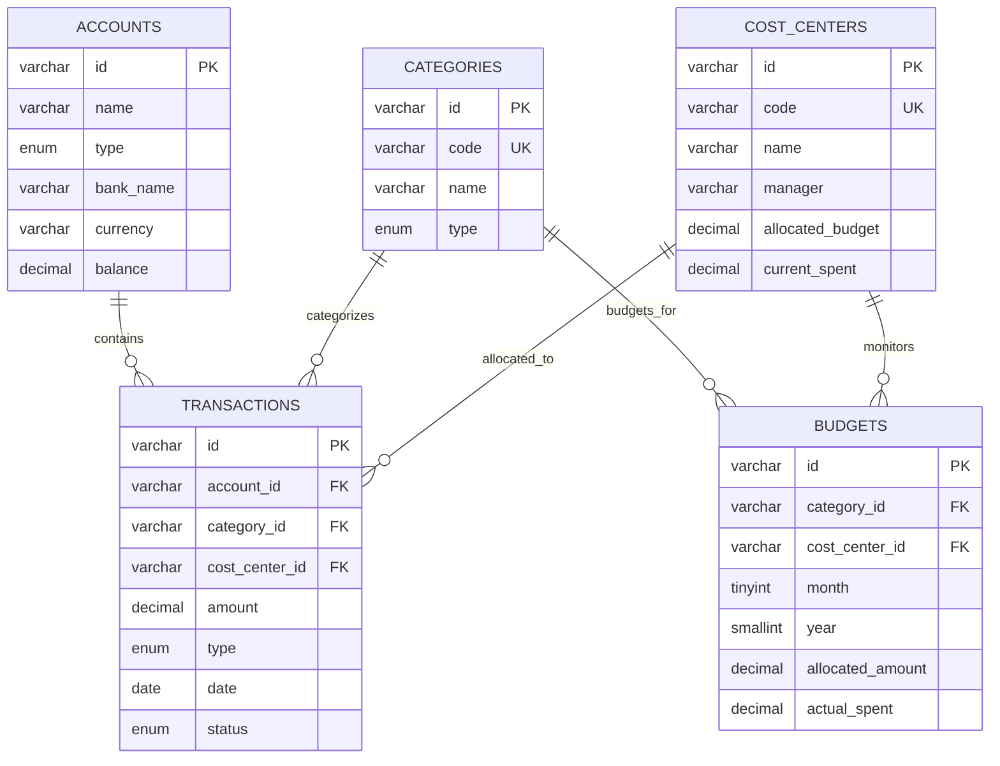

# FinFlow B2B — Dashboard Financiero Corporativo & CFO Intelligence

[](https://alxnrocha.github.io/financial-dashboard/)
[](https://react.dev/)
[](https://www.typescriptlang.org/)
[](https://tailwindcss.com/)
[](https://www.mysql.com/)
[](https://recharts.org/)
[](https://github.com/pmndrs/zustand)
[](https://vitest.dev/)
[](https://oxc.rs/)
[](LICENSE)

> **Proyecto 12 del Portafolio Profesional** — Plataforma SPA corporativa de analítica financiera, DRE gerencial, proyección de flujo de caja y control presupuestario para directores financieros (CFO) y operaciones B2B.  
> 🔗 **Demo en Vivo en GitHub Pages:** [https://alxnrocha.github.io/financial-dashboard/](https://alxnrocha.github.io/financial-dashboard/)

---

## 🌟 Visión General & Propuesta de Valor

**FinFlow** es una plataforma SPA corporativa de inteligencia financiera diseñada para directores financieros (CFO) y equipos de operaciones B2B.

Permite consolidar estados de resultados (DRE), proyectar flujo de caja, monitorear desvíos presupuestarios por centro de costo y auditar transacciones con soporte multimoneda y multi-entidad.

---

## ✨ Características Principales

- **DRE Gerencial (Income Statement):** Estructura contable jerárquica con filas expandibles (Gross Revenue -> Deductions -> Net Revenue -> COGS -> Gross Profit -> OPEX -> EBITDA -> EBIT) con cálculo de variaciones nominales y porcentuales.
- **Resumen Ejecutivo de KPIs:** Métricas en tiempo real de ingresos netos, gastos operativos (OPEX), margen EBITDA (45.4%), runway de caja y ritmo de crecimiento.
- **Proyección de Flujo de Caja:** Gráfico de área dual en Recharts con saldo histórico y modelos predictivos a 30 días con filtros temporales.
- **Desglose de Centros de Costo:** Gráfico circular Donut interactivo con cuota de gasto y barras de consumo de presupuesto.
- **Control Presupuestario (Budget vs Actual):** Detección de sobregastos con alertas visuales de desviación e indicadores de holgura.
- **Tabla de Auditoría de Transacciones:** Tabla interactiva construida con TanStack Table v8, ordenación multicolumna y filtros.

---

## 📊 Diagrama Entidad-Relación (MySQL 8.4 DDL)



---

## 🏛️ Arquitectura del Proyecto

```text
12-financial-dashboard/
├── index.html
├── src/
│   ├── components/                # DRETable, CashFlowChart, CostCenterDonut, TransactionTable
│   ├── data/                      # Fixtures financieras determinísticas
│   ├── stores/                    # Zustand store para tesorería y presupuestos
│   ├── types/                     # Tipos TypeScript contables y financieros
│   ├── App.tsx                    # Componente raíz
│   └── main.tsx                   # Punto de entrada
├── LICENSE
├── package.json
└── vite.config.ts
```

---

## 🚀 Instalación y Puesta en Marcha

### Prerrequisitos
- Node.js `>= 20.0.0`
- npm `>= 10.0.0`

### Pasos

1. **Clonar el repositorio:**
   ```bash
   git clone https://github.com/alxnrocha/financial-dashboard.git
   cd financial-dashboard
   ```

2. **Instalar dependencias:**
   ```bash
   npm install
   ```

3. **Ejecutar en modo desarrollo:**
   ```bash
   npm run dev
   ```

4. **Ejecutar suite de pruebas unitarias:**
   ```bash
   npm test
   ```

5. **Compilar para producción:**
   ```bash
   npm run build
   ```

---

## 🛡️ Calidad de Código & Testing

- **Pruebas Automatizadas:** 26 pruebas unitarias de reglas financieras con Vitest.
- **Análisis Estático:** Cero errores y cero advertencias con Oxlint.
- **Tipado Estricto:** TypeScript en modo estricto.

---

## 📄 Licencia

Este proyecto se encuentra bajo la Licencia MIT. Consulta el archivo [LICENSE](LICENSE) para más detalles.
