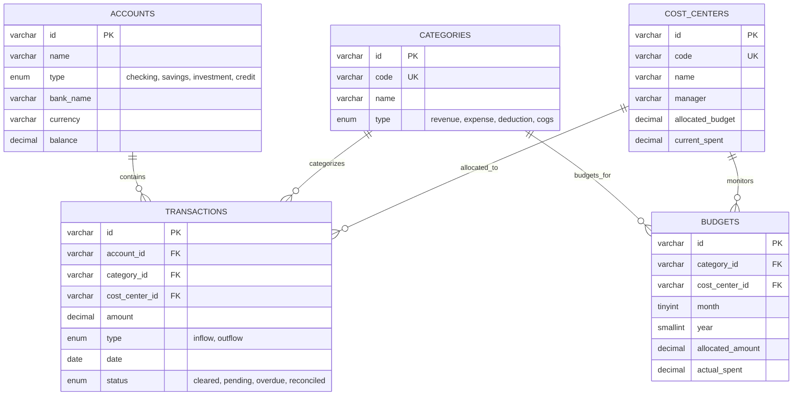

# FinFlow B2B — Dashboard Financiero Corporativo & CFO Intelligence

[](https://alxnrocha.github.io/financial-dashboard/)
[](https://react.dev/)
[](https://www.typescriptlang.org/)
[](https://tailwindcss.com/)
[](https://recharts.org/)
[](https://github.com/pmndrs/zustand)
[](https://vitejs.dev/)
[](LICENSE)

> **Proyecto 12 del Portafolio Profesional** — Plataforma SPA corporativa de analítica financiera, DRE gerencial, proyección de flujo de caja y control presupuestario para directores financieros (CFO) y operaciones B2B.  
> 🔗 **Demo en Vivo en GitHub Pages:** [https://alxnrocha.github.io/financial-dashboard/](https://alxnrocha.github.io/financial-dashboard/)

---

## ✨ Características Principales

### 🚀 Inteligencia Financiera & Frontend
- **DRE Gerencial (Income Statement):** Estructura contable jerárquica con filas expandibles (Gross Revenue -> Deductions -> Net Revenue -> COGS -> Gross Profit -> OPEX [Sales & Mkt, R&D, G&A] -> EBITDA -> EBIT) con cálculo de variaciones nominales y porcentuales.
- **Resumen Ejecutivo de KPIs:** Métricas en tiempo real de ingresos netos, gastos operativos (OPEX), margen EBITDA (45.4%), runway de caja en meses y ritmo de crecimiento interanual.
- **Proyección de Flujo de Caja:** Gráfico de área dual en Recharts con saldo histórico y modelos predictivos a 30 días con filtros temporales (1M, 3M, 6M, 1Y, YTD).
- **Desglose de Centros de Costo:** Gráfico circular (donut) interactivo con cálculo de cuota de gasto y barras de consumo de presupuesto.
- **Control Presupuestario (Budget vs Actual):** Detección de sobregastos con alertas visuales de desviación e indicadores de holgura de capital.
- **Gestión de Cuentas y Tesorería:** Supervisión de bóvedas bancarias conectadas (SVB, JPMorgan, Wise) con creación dinámica de cuentas.
- **Tabla de Auditoría de Transacciones:** Tabla interactiva construida con TanStack Table v8, ordenación multicolumna, filtros por estado (`cleared`, `pending`, `overdue`, `reconciled`), paginación y búsqueda global.
- **Centro de Exportación:** Modal para descarga de reportes ejecutivos en PDF, CSV y Excel (XLSX).

---

## 🏛️ Arquitectura & Modelo de Datos (MySQL 8.4 DDL)



---

## 🛠️ Stack Tecnológico

- **Frontend Core:** React 19, TypeScript 5.7, Vite 8.2.
- **Estilos & Diseño:** Tailwind CSS v4, Lucide React (iconografía SVG accesible), Google Fonts (Inter).
- **Visualización de Datos:** Recharts 3 (Gráficos compuestos de flujo y distribución Donut).
- **Tablas Avanzadas:** TanStack Table v8 (Data grid con filtrado reactivo y ordenación).
- **Estado Global:** Zustand 5 con selectores de dominio y mutadores atómicos.
- **Calidad & Pruebas:** Vitest (26 pruebas unitarias de reglas financieras), Oxlint (linter de alta velocidad).
- **Base de Datos Teórica:** MySQL 8.4 LTS (`database/schema.sql` y `database/seed.sql`).

---

## ⚡ Guía de Inicio Rápido

### 1. Clonar e Instalar

```bash
git clone https://github.com/alxnrocha/financial-dashboard.git
cd financial-dashboard
npm install
```

### 2. Ejecutar en Desarrollo

```bash
npm run dev
```

La aplicación estará disponible en [http://localhost:5173](http://localhost:5173).

---

## 🧪 Pruebas Automatizadas y Calidad

```bash
# Ejecutar suite de pruebas unitarias financieras
npm test

# Ejecutar análisis estático con Oxlint
npm run lint

# Compilar paquete de producción
npm run build
```

---

## 📄 Licencia

Distribuido bajo la Licencia MIT. Consulte el archivo [LICENSE](./LICENSE) para más información.

**Autor:** [Alexandre Rocha](https://github.com/alxnrocha)
