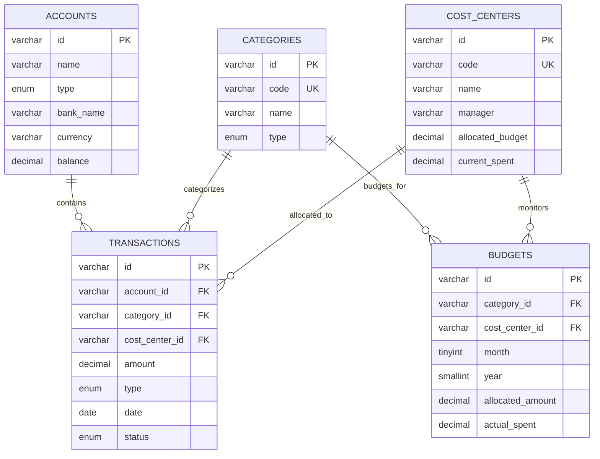

# FinFlow B2B — Dashboard Financiero Corporativo & CFO Intelligence

<div align="center">


**Plataforma SPA corporativa de inteligencia financiera, DRE gerencial jerárquico, proyección de flujo de caja y control presupuestario por centros de costo para directores financieros (CFO).**

[🚀 Demo en Vivo](https://alxnrocha.github.io/financial-dashboard/) • [📂 Repositorio en GitHub](https://github.com/alxnrocha/financial-dashboard)

</div>

---

## 🏛️ Arquitectura y Modelo de Datos



---

## ✨ Características Principales

- **DRE Gerencial (Income Statement):** Estructura contable jerárquica con filas expandibles (Gross Revenue ➔ Deductions ➔ Net Revenue ➔ COGS ➔ Gross Profit ➔ OPEX ➔ EBITDA ➔ EBIT) con cálculo de variaciones nominales y porcentuales.
- **Resumen Ejecutivo de KPIs:** Métricas en tiempo real de ingresos netos, gastos operativos (OPEX), margen EBITDA (45.4%), runway de caja y ritmo de crecimiento.
- **Proyección de Flujo de Caja:** Gráfico de área dual en Recharts con saldo histórico y modelos predictivos a 30 días con filtros temporales.
- **Desglose de Centros de Costo:** Gráfico circular Donut interactivo con cuota de gasto y barras de consumo de presupuesto.
- **Control Presupuestario (Budget vs Actual):** Detección de sobregastos con alertas visuales de desviación e indicadores de holgura.
- **Tabla de Auditoría de Transacciones:** Tabla interactiva construida con TanStack Table v8, ordenación multicolumna y filtros.

---

## 🗂️ Estructura del Proyecto

```text
12-financial-dashboard/
├── index.html
├── src/
│   ├── components/                # DRETable, CashFlowChart, CostCenterDonut, TransactionTable
│   ├── data/                      # Fixtures financieras determinísticas
│   ├── stores/                    # Zustand store para tesorería y presupuestos
│   ├── types/                     # Tipos TypeScript contables y financieros
│   ├── App.tsx                    # Componente raíz
│   └── main.tsx                   # Punto de entrada React 19
├── tests/                         # Suite de pruebas unitarias Vitest
├── package.json
├── tsconfig.json
└── vite.config.ts
```

---

## 🚀 Instalación y Puesta en Marcha

### Prerrequisitos
- Node.js `>= 20.0.0`
- npm `>= 10.0.0`

### Ejecución Local
```bash
# 1. Clonar el repositorio
git clone https://github.com/alxnrocha/financial-dashboard.git
cd financial-dashboard

# 2. Instalar dependencias
npm install

# 3. Iniciar servidor de desarrollo
npm run dev

# 4. Ejecutar suite de pruebas unitarias (26 tests)
npm test

# 5. Compilar para producción
npm run build
```

---

## 🛠️ Tecnologías Utilizadas

| Capa | Tecnología | Aspectos Clave |
|---|---|---|
| **Framework** | React 19 | Hooks modernos, arquitectura modular por widgets financieros |
| **Lenguaje** | TypeScript 5.8 | Tipado estricto para cuentas contables y balances |
| **Estado Global** | Zustand 5.0 | Gestión reactiva de tesorería y presupuestos |
| **Visualización** | Recharts 2.15 | Gráficos de flujo de caja y distribución por centros de costo |
| **Testing** | Vitest | 26 pruebas unitarias de cálculo financiero y DRE |
| **Despliegue** | GitHub Pages | Despliegue estático continuo y optimizado |

---

<div align="center">
  <sub>Desarrollado con dedicación por <a href="https://github.com/alxnrocha">Alex Rocha</a> • Proyecto 12 del Portafolio Profesional Frontend.</sub>
</div>
